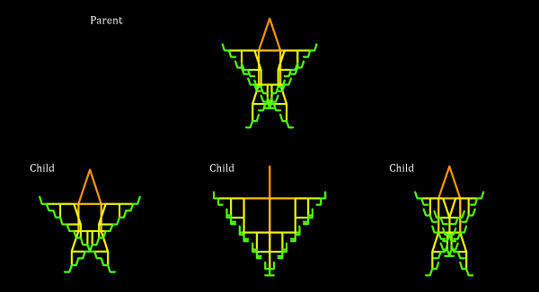

# Biomorph
grade 12 project

The objective of bioMorph is to loosely mimic the concept of natural selection found in any given ecosystem, whereby an organism reproduces and creates children with slightly modified genetic makeups. It is designed to allow you, its user, full control over the surviving organisms, and to display the evolutionary changes throughout the passing generations.

video: https://www.youtube.com/watch?time_continue=1&v=5QU6iysNPH4

